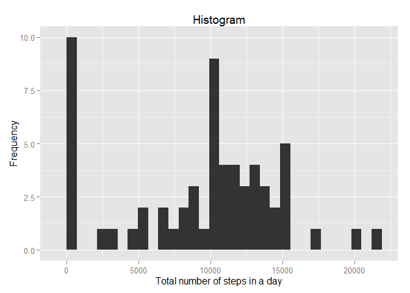
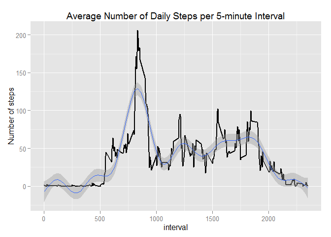
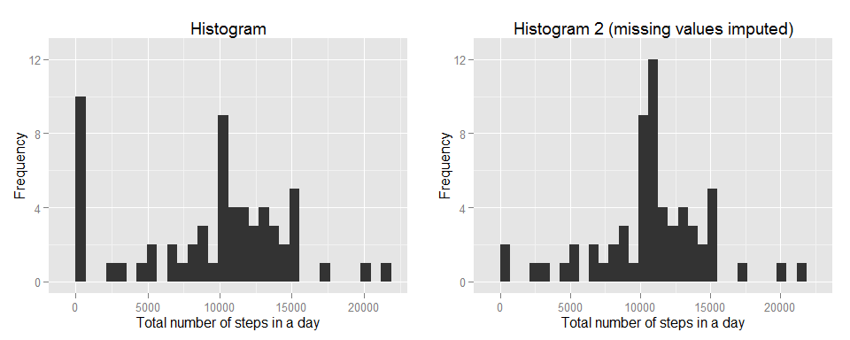
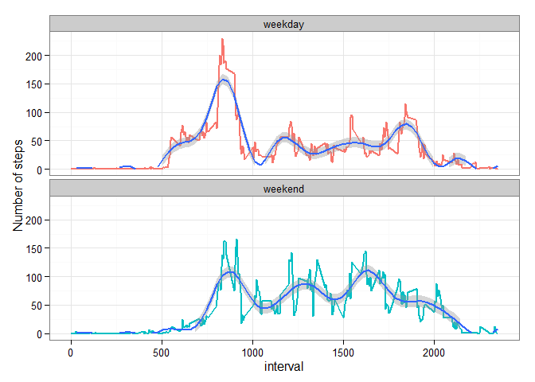

# Reproducible Research: Peer Assessment 1


## Downloading the data

The data can be downloaded from [here](https://d396qusza40orc.cloudfront.net/repdata%2Fdata%2Factivity.zip).

This code gets the data downloaded and stored in file `activity.csv` in the working directory.


```r
if(!file.exists("activity.csv")){
        zipfileURL = "https://d396qusza40orc.cloudfront.net/repdata%2Fdata%2Factivity.zip"
        download.file(zipfileURL, destfile="activity.zip", method = "libcurl")
        unzip("activity.zip")
}
```


## Loading and preprocessing the data

The data in the `activity.csv` file is load into R. Then we take a fist look at the data, using the head, tail and str functions of R.


```r
activityData = read.csv("activity.csv")
head(activityData)
```

```
##   steps       date interval
## 1    NA 2012-10-01        0
## 2    NA 2012-10-01        5
## 3    NA 2012-10-01       10
## 4    NA 2012-10-01       15
## 5    NA 2012-10-01       20
## 6    NA 2012-10-01       25
```

```r
tail(activityData)
```

```
##       steps       date interval
## 17563    NA 2012-11-30     2330
## 17564    NA 2012-11-30     2335
## 17565    NA 2012-11-30     2340
## 17566    NA 2012-11-30     2345
## 17567    NA 2012-11-30     2350
## 17568    NA 2012-11-30     2355
```

```r
str(activityData)
```

```
## 'data.frame':	17568 obs. of  3 variables:
##  $ steps   : int  NA NA NA NA NA NA NA NA NA NA ...
##  $ date    : Factor w/ 61 levels "2012-10-01","2012-10-02",..: 1 1 1 1 1 1 1 1 1 1 ...
##  $ interval: int  0 5 10 15 20 25 30 35 40 45 ...
```

```r
summary(activityData)
```

```
##      steps                date          interval     
##  Min.   :  0.00   2012-10-01:  288   Min.   :   0.0  
##  1st Qu.:  0.00   2012-10-02:  288   1st Qu.: 588.8  
##  Median :  0.00   2012-10-03:  288   Median :1177.5  
##  Mean   : 37.38   2012-10-04:  288   Mean   :1177.5  
##  3rd Qu.: 12.00   2012-10-05:  288   3rd Qu.:1766.2  
##  Max.   :806.00   2012-10-06:  288   Max.   :2355.0  
##  NA's   :2304     (Other)   :15840
```
 
 
It can be seen that:

- The `steps` variable has missing values (denoted by `NA`), and recognized as integer type 
- The `date` variable is recognized as a factor so it needs to be transformed into a Date type
- The `interval` variable is recognized as an integer type with no missing values.
 
 Getting the `date` variable converted in date format.
 

```r
activityData$date = as.Date(activityData$date) 
summary(activityData$date)
```

```
##         Min.      1st Qu.       Median         Mean      3rd Qu. 
## "2012-10-01" "2012-10-16" "2012-10-31" "2012-10-31" "2012-11-15" 
##         Max. 
## "2012-11-30"
```

```r
str(activityData$date)
```

```
##  Date[1:17568], format: "2012-10-01" "2012-10-01" "2012-10-01" "2012-10-01" ...
```
 
The variable `date` is coerced into the Date type and checked for missing values.

## What is mean total number of steps taken per day?

Firts, we take a look at a histogram or the total number of steps taken per day.
Second, we see a summary of the daily total number of steps statistics 


```r
stepsPerDay = data.frame(stepsPerDay = with(activityData, tapply(steps, date, function(x) sum(x, na.rm= TRUE))))
library(ggplot2)
g1 <- ggplot(data = stepsPerDay, aes(stepsPerDay))
g1 <- g1 + geom_histogram()+labs(x="Total number of steps in a day", y = "Frequency", title = "Histogram")
g1
```

 

```r
library(xtable)
summSteps <- summary(stepsPerDay$stepsPerDay)
xt <- xtable(t(summSteps))
caption(xt) = "Statistics for Daily Total Number of Steps"
print(xt, type = "html",include.rownames = FALSE)
```

<!-- html table generated in R 3.2.0 by xtable 1.7-4 package -->
<!-- Wed Jun 10 23:17:39 2015 -->
<table border=1>
<caption align="bottom"> Statistics for Daily Total Number of Steps </caption>
<tr> <th> Min. </th> <th> 1st Qu. </th> <th> Median </th> <th> Mean </th> <th> 3rd Qu. </th> <th> Max. </th>  </tr>
  <tr> <td align="right"> 0.00 </td> <td align="right"> 6778.00 </td> <td align="right"> 10400.00 </td> <td align="right"> 9354.00 </td> <td align="right"> 12810.00 </td> <td align="right"> 21190.00 </td> </tr>
   </table>

The median is 10,400 daily total steps and the mean is 9,354 daily total steps. 

## What is the average daily activity pattern?


```r
meanStepsInterval = data.frame(mean = with(activityData, 
                                           tapply(steps, interval, 
                                                  function(x) mean(x, na.rm = TRUE))))
plot(rownames(meanStepsInterval),meanStepsInterval$mean,type="l", main="Average Number of Daily Steps per 5-minute Interval", xlab = "5-minute Interval", ylab="" )
```

 


```r
# Interval with the maximum number of steps

intervalMaxSteps = as.integer(names(which.max(meanStepsInterval$mean)))
maxAverSteps = as.numeric(meanStepsInterval$mean[which.max(meanStepsInterval$mean)])
intervalPrev = intervalMaxSteps - 5
intervalHours1 = as.integer(intervalMaxSteps/60)
intervalMinutes1 = intervalMaxSteps - intervalHours1*60
intervalHours2 = as.integer(intervalPrev/60)
intervalMinutes2 = intervalPrev - intervalHours2*60
```

The maximum average number of steps in a 5-min interval is 206.2 and it occurs between  13:50 and 13:55.

## Imputing missing values


```r
goodRows = complete.cases(activityData)
numberRowsMissing = length(activityData$steps) - sum(goodRows)
numberRowsMissingPct = numberRowsMissing / length(activityData$steps) *100
colSums(is.na(activityData))
```

```
##    steps     date interval 
##     2304        0        0
```


The total number of rows with missing values is 2,304, which is a
13.1% of the total number of rows.  This number coincides with the number of missing values for the steps variable.


```r
activityData2 = activityData
meanStepsInterval$interval = as.integer(rownames(meanStepsInterval$mean))
for (i in 1:length(goodRows)) {
        if(!goodRows[i]) {
                activityData2$steps[i] = meanStepsInterval$mean[which(meanStepsInterval$interval == 
                                                                      activityData2$interval[i])]
        }
}
summary(activityData2)
```

```
##      steps             date               interval     
##  Min.   :  0.00   Min.   :2012-10-01   Min.   :   0.0  
##  1st Qu.:  0.00   1st Qu.:2012-10-16   1st Qu.: 588.8  
##  Median :  0.00   Median :2012-10-31   Median :1177.5  
##  Mean   : 37.38   Mean   :2012-10-31   Mean   :1177.5  
##  3rd Qu.: 27.00   3rd Qu.:2012-11-15   3rd Qu.:1766.2  
##  Max.   :806.00   Max.   :2012-11-30   Max.   :2355.0
```


These missing values were substituted by the mean number steps for the corresponding 5-minute interval.  A new dataset was created with the missing data fill in this way.


```r
stepsPerDay2 = data.frame(stepsPerDay = with(activityData2, tapply(steps, date, sum)))
library(ggplot2)
g2 <- ggplot(data = stepsPerDay2, aes(stepsPerDay))
g2 <- g2 + geom_histogram()+labs(x="Total number of steps in a day", y = "Frequency", title = "Histogram 2 (missing values imputed)")
library(gridExtra)
```

```
## Loading required package: grid
```

```r
grid.arrange(g1 + ylim(0, 12.5), g2 + ylim(0, 12.5), nrow = 2)
```

 

```r
library(xtable)
summSteps2 <- summary(stepsPerDay2$stepsPerDay)
xt <- xtable(t(summSteps2))
caption(xt) = "Statistics for Daily Total Number of Steps (missing values imputed)"
print(xt, type = "html",include.rownames = FALSE)
```

<!-- html table generated in R 3.2.0 by xtable 1.7-4 package -->
<!-- Wed Jun 10 23:17:40 2015 -->
<table border=1>
<caption align="bottom"> Statistics for Daily Total Number of Steps (missing values imputed) </caption>
<tr> <th> Min. </th> <th> 1st Qu. </th> <th> Median </th> <th> Mean </th> <th> 3rd Qu. </th> <th> Max. </th>  </tr>
  <tr> <td align="right"> 41.00 </td> <td align="right"> 9819.00 </td> <td align="right"> 10770.00 </td> <td align="right"> 10770.00 </td> <td align="right"> 12810.00 </td> <td align="right"> 21190.00 </td> </tr>
   </table>

From comparison with both histograms, it can be inferred that days with lots of missing data were having total steps close to zero, which it would mean that missing values were concentrated in specific days.  After missing values were imputed, there's more days with values greater than 10,000 steps than before.

The median for the steps variable in the new dataset  is 10,770 daily total steps and the mean is 10,770 daily total steps, which are both greater than the corresponding values for the original data with missing values not imputed.


## Are there differences in activity patterns between weekdays and weekends?


```r
Sys.setlocale("LC_TIME", "English_United States.1252")
```

```
## [1] "English_United States.1252"
```

```r
weekd <- c("Monday","Tuesday","Wednesday","Thursday","Friday")
activityData2$wkd = ifelse(is.element(weekdays(activityData2$date),weekd),"weekday","weekend")
table(activityData2$wkd)
```

```
## 
## weekday weekend 
##   12960    4608
```

```r
meanStepsWeekday = data.frame(mean = with(activityData2[activityData2$wkd == "weekday",], 
                                           tapply(steps, interval, mean)))
meanStepsWeekday$interval = as.integer(rownames(meanStepsWeekday$mean))
meanStepsWeekday$wkd = factor(rep("weekday"))
meanStepsWeekend = data.frame(mean = with(activityData2[activityData2$wkd == "weekend",], 
                                           tapply(steps, interval, mean)))
meanStepsWeekend$interval = as.integer(rownames(meanStepsWeekend$mean))
meanStepsWeekend$wkd = factor(rep("weekend"))
meanSteps= rbind(meanStepsWeekday,meanStepsWeekend)
ggplot(data = meanSteps) + geom_line(aes(x = interval , y = mean, group = wkd, 
    colour = wkd ), size = 1) + facet_wrap(~wkd, ncol = 1, scales = "free_y") + 
    theme_bw() + theme(legend.position = "none") + labs(y = "Number of steps")
```

 

A new factor variable was created to indicate whether data was recorded on a weekday or a weekend day.  This variable was used to create daily activity patterns for intervals.  The average number of steps was calculated for each interval for weekdays and for weekend days and presented in the graphs below.  From this graphs, it might be inferred that during weekends, activity starts later than in weekdays, having peaks at around the same time, but the average activity is greater for weekend days and lasts a little later than in weekdays.  

